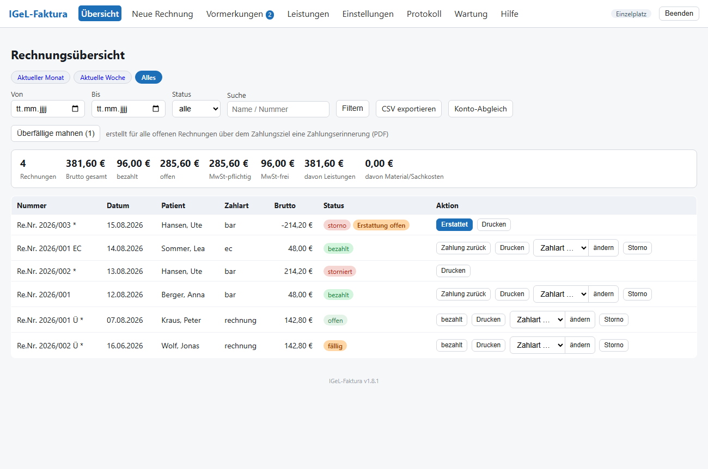
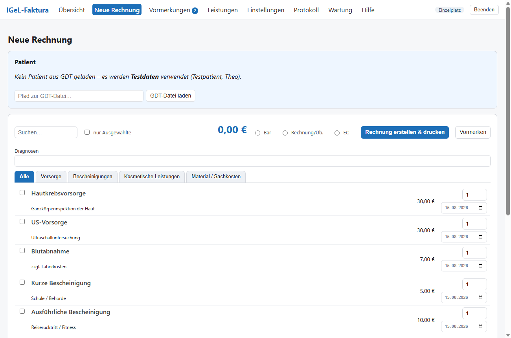
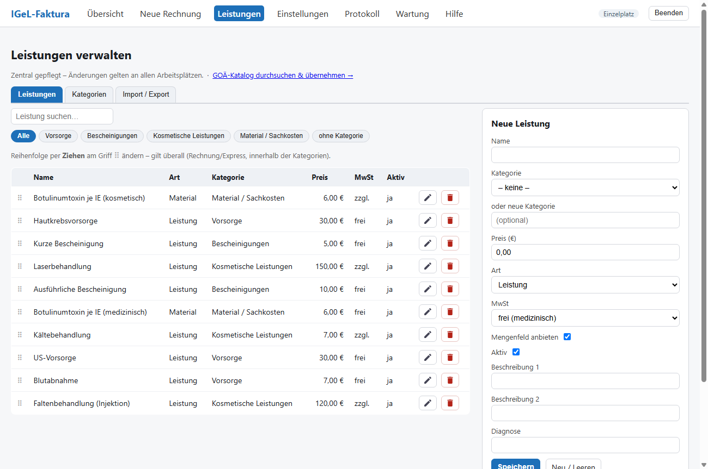
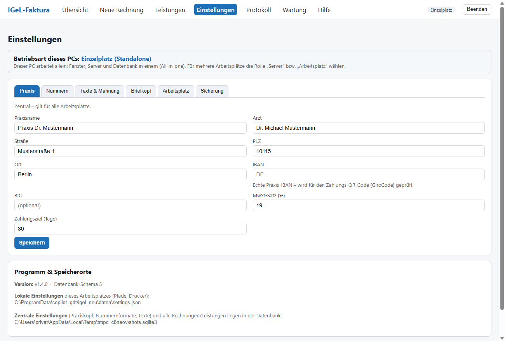
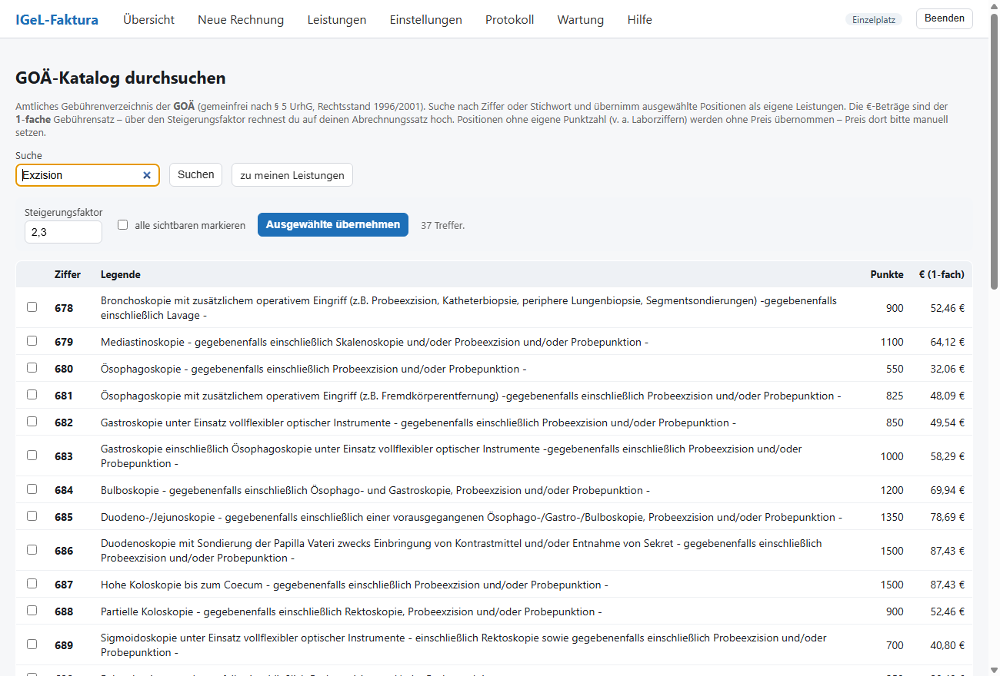
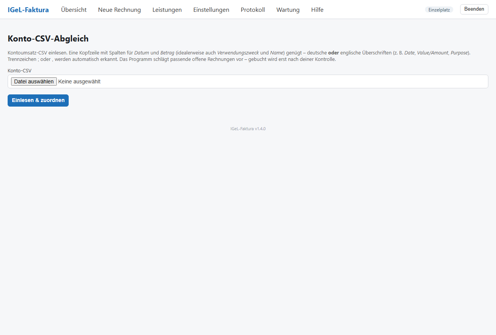
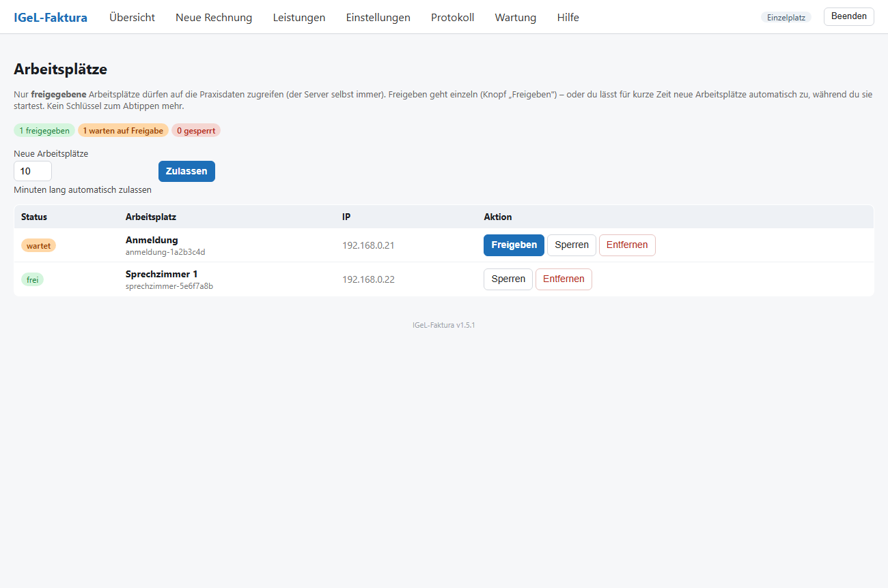
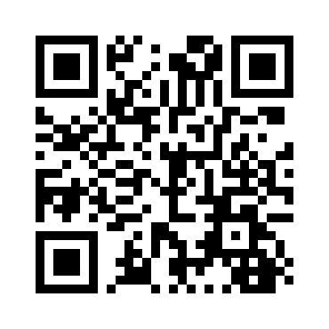

# IGeL-Faktura

**Rechnungen für individuelle Gesundheitsleistungen (IGeL/Selbstzahler) – direkt aus T2med, GoBD-konform.**

IGeL-Faktura erstellt Privat-/IGeL-Rechnungen aus den Patientendaten von **T2med** (über die GDT-Schnittstelle), verwaltet ein zentrales Leistungsmenü und führt eine **revisionssichere** (GoBD-konforme) Rechnungsliste. Die Oberfläche läuft in einem eigenen Fenster mit eingebautem Browser – **keine Installation, kein .NET, kein externer Browser** nötig.

## Screenshots

| Rechnungsübersicht | Neue Rechnung |
|---|---|
|  |  |
| **Leistungen verwalten** | **Einstellungen** |
|  |  |
| **GOÄ-Katalog** | **Konto-Abgleich** |
|  |  |
| **Arbeitsplätze (Freigabe)** | |
|  | |

## Funktionen

- **T2med / GDT-Anbindung** – der Patient kommt automatisch per GDT; die PDF-Rechnung und die GDT-Rückgabe landen wieder bei T2med.
- **Privat-/IGeL-Rechnungen als PDF** (DIN-5008-Layout), mit **GiroCode / EPC-QR-Code** zum bequemen Bezahlen.
- **Gemischte MwSt** (steuerfreie und steuerpflichtige Leistungen) auf einer Rechnung – korrekt nach Steuersätzen aufgeschlüsselt (§14 UStG).
- **Revisionssicher / GoBD** – gebuchte Rechnungen werden nicht geändert oder gelöscht (Storno statt Korrektur), fortlaufende eindeutige Nummern, lückenloses Protokoll.
- **Zahlungserinnerungen** für überfällige Rechnungen (mit optionaler GDT-Datei für T2med).
- **Leistungsmenü** mit Kategorien, Drag-&-Drop-Sortierung und CSV-Import.
- **GOÄ-Katalog** – das amtliche Gebührenverzeichnis durchsuchen und Positionen mit einstellbarem Steigerungsfaktor als eigene Leistungen übernehmen.
- **Konto-Abgleich** – Kontoumsatz-CSV einlesen (deutsche **oder englische** Spaltenüberschriften), Zahlungseingänge automatisch zuordnen und sammelweise als bezahlt buchen. Farb-Ampel (🟢 über die Rechnungsnummer erkannt / 🟠 nur vermutet); eine Sammelüberweisung kann mehrere Rechnungen auf einmal begleichen.
- **Verfahrensdokumentation (GoBD)** direkt im Programm – druck-/PDF-fähig, mit Praxisdaten vorausgefüllt (für Steuerberater / Betriebsprüfung).
- **Ein- oder Mehrplatz** mit klaren Rollen: **Einzelplatz**, **Server** oder **Arbeitsplatz** – direkt im Programm wählbar. Neue Arbeitsplätze werden am Server per Klick **freigegeben** (kein Schlüssel zum Abtippen).
- **Automatisches Update** der Arbeitsplätze vom Server (die lokalen Daten bleiben erhalten).
- **Automatische Datensicherung** (Tages-/Wochensicherungen) und eine Wartungsseite mit Integritätsprüfung.

## Download & Installation

IGeL-Faktura läuft auf **Windows und Linux** – Server und Arbeitsplätze dürfen gemischt sein
(passend zu T2med, das beide Systeme beliebig kombinieren lässt).

1. Unter **[Releases](../../releases)** das Paket für Ihr System herunterladen (Windows bzw.
   `…-linux`).
2. Entpacken – der Ordner ist portabel – und starten:
   - **Windows:** `IGeL-Faktura.exe`
   - **Linux:** `./IGeL-Faktura`
3. In den **Einstellungen** Praxisdaten, IBAN/BIC, GDT-Ordner und Drucker eintragen.
4. **T2med**: den Express-Aufruf auf das Programm mit dem Argument `--express` einrichten
   (Windows z. B. `…\IGeL-Faktura.exe --express`).

**Unterstützte Systeme:** Windows 11 · Ubuntu 22.04 / 24.04 LTS.
Die ausführliche Administrator-Anleitung (`README.txt`) liegt jedem Paket bei.

## Unterstützen

IGeL-Faktura ist kostenlos nutzbar. Wer die Weiterentwicklung **freiwillig** unterstützen möchte, kann das per PayPal tun:

**→ [paypal.me/ChristianSchulze216](https://www.paypal.me/ChristianSchulze216)**

*Rein freiwillig – ein Dankeschön, keine Voraussetzung für die Nutzung.*

## Hinweise

- Alle Änderungen je Version: siehe **[CHANGELOG.md](CHANGELOG.md)**.
- **Nutzungsbedingungen / Lizenz:** siehe **[LICENSE.md](LICENSE.md)** – kostenlose Nutzung, ohne Gewähr.
- **Drittanbieter-Lizenzen:** Das Programm bündelt Fremdkomponenten (u. a. SumatraPDF unter GPL – nur im Windows-Paket, Qt/PySide6 unter LGPL); deren Lizenzen und Quellenangaben liegen dem Download als `THIRD-PARTY-LICENSES.txt` bei.
- In diesem Repository liegt **kein Quellcode** – nur die fertige Anwendung (unter *Releases*) und diese Kurzanleitung.
- Nutzung in eigener Verantwortung, ohne Gewähr. Steuer- und GoBD-Fragen bitte mit dem Steuerberater klären.
